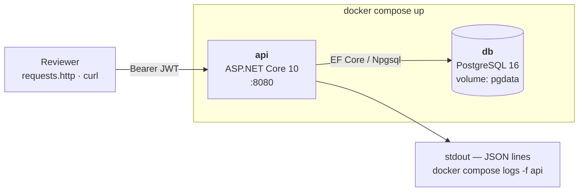
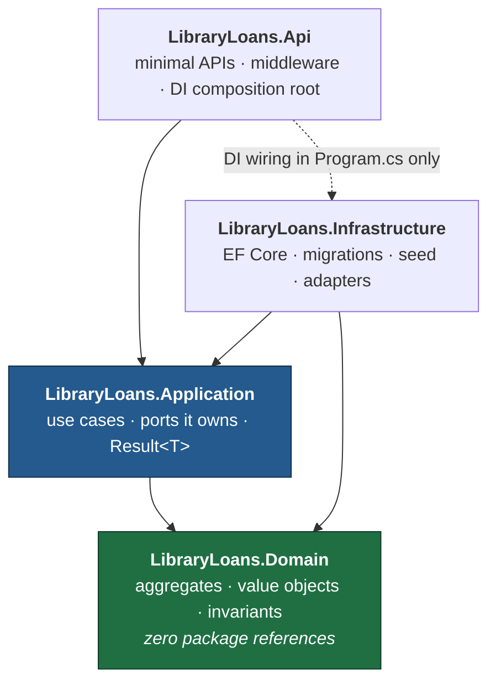
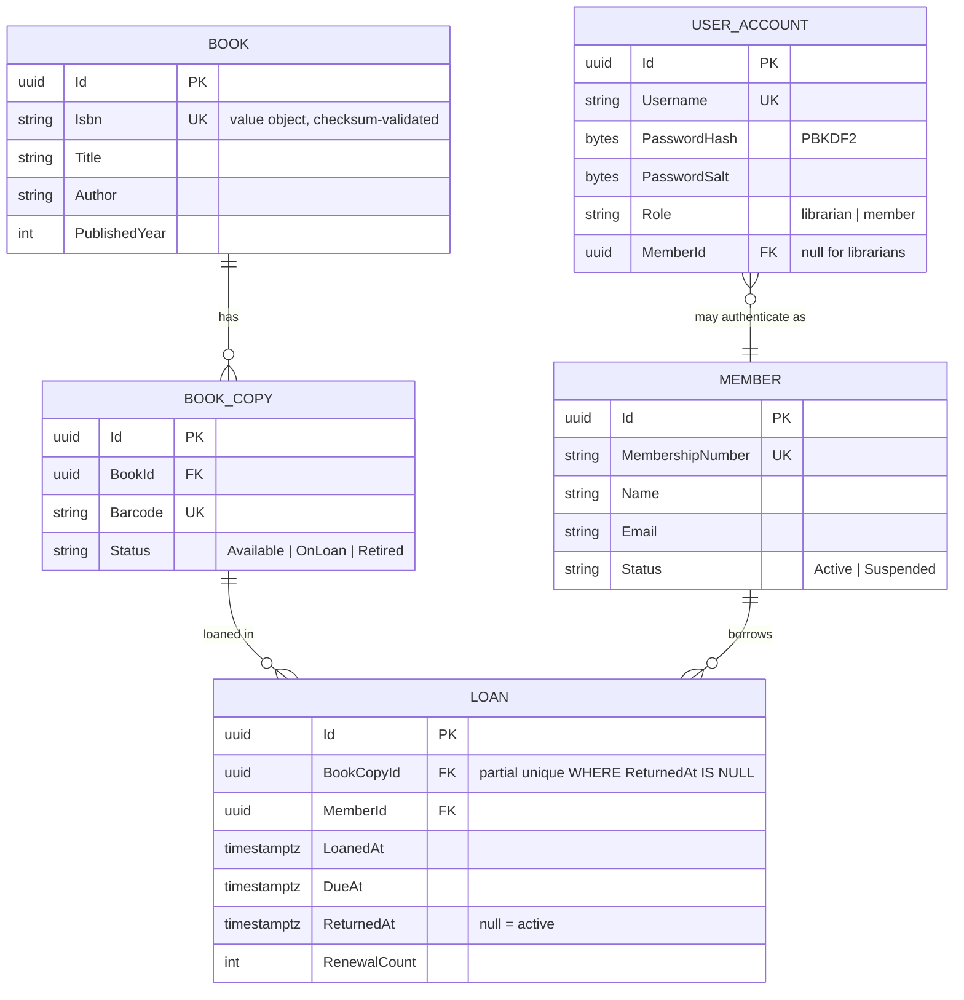
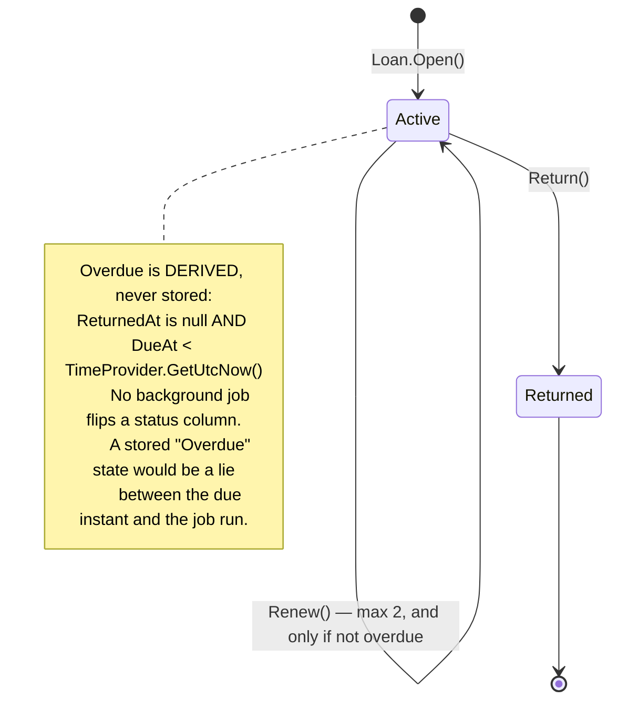
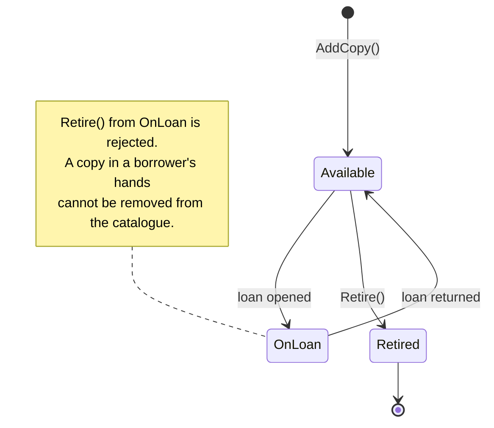
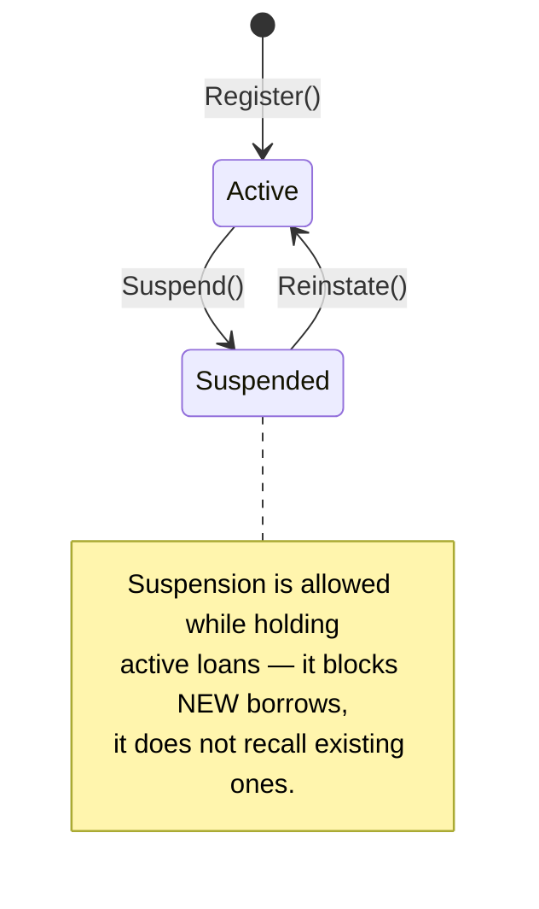
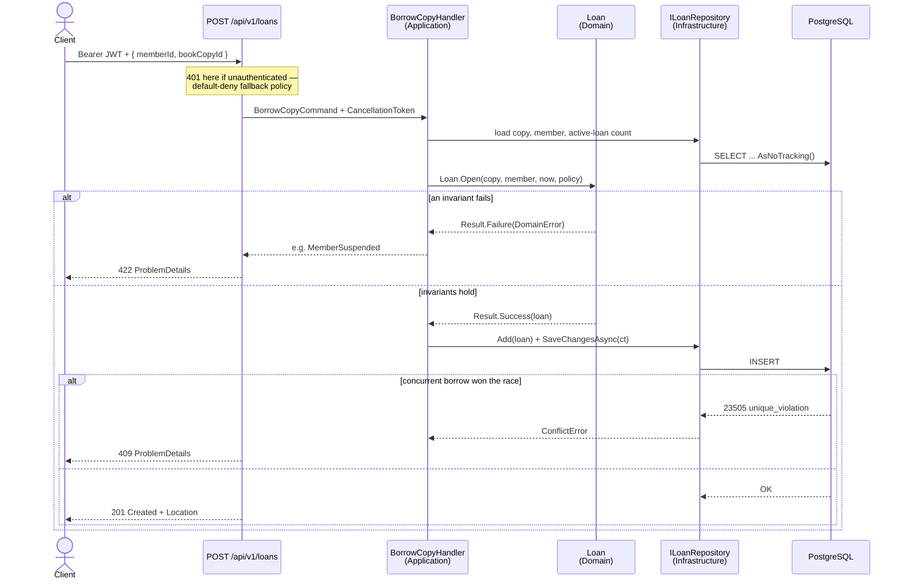

# Architecture — Library Loans API

## 1. Deployment view

Everything a reviewer needs is two containers behind one command.

The `api` service waits on the `db` healthcheck, applies migrations, then seeds if the
database is empty. No manual DB creation step — see `AUTH.md`.

## 2. Layers and the dependency rule

Arrows are compile-time references. **They only point inward.**

The dashed arrow is the only concession: `Api` references `Infrastructure` purely to
register implementations in `Program.cs`. Nothing else in `Api` may use an
`Infrastructure` type.

`Application` **owns** the port interfaces (`IBookRepository`, `ILoanRepository`,
`IUnitOfWork`); `Infrastructure` implements them. That is the dependency inversion that
makes `Application` testable with hand-written fakes and no database.

**Enforced by test, not by convention:** `ArchitectureTests.Domain_has_no_infrastructure_dependencies`
reflects over the Domain assembly and fails the build if EF Core or ASP.NET Core ever
appears in its reference graph.

## 3. Domain model

## 4. State machines

### Loan

Guards on `Loan.Open()` — all enforced inside the aggregate, none in a service:
- the copy has no active loan (**also** a DB partial unique index)
- the copy is not `Retired`
- the member is `Active`, not `Suspended`
- the member holds fewer than 5 active loans

`Return()` on an already-returned loan is a **domain error**, not a silent no-op.

### BookCopy

### Member

## 5. Request flow — the borrow path

This is the sequence worth reading, because it shows the invariant enforced at two levels
and what happens when a race is lost.

**Why both checks.** The aggregate check gives a clean, fast, well-worded rejection for the
common case. The partial unique index is the one that cannot be raced — two requests can
both pass the in-memory check microseconds apart, and exactly one INSERT survives. Catching
`23505` and translating it to a 409 is what makes the rule actually true under concurrency.
Enforcing it only in the aggregate is the mistake most submissions make.

## 6. Cross-cutting concerns

| Concern | Mechanism | Package |
|---|---|---|
| Structured logging | Serilog → JSON console sink, message templates, no string interpolation | Serilog |
| Request logging | `UseSerilogRequestLogging()` — one enriched line per request with method, path, status and elapsed ms | Serilog |
| Correlation | middleware generates/echoes `X-Correlation-Id`, pushed as a log scope so every line in a request carries it | built-in |
| Error shaping | `IExceptionHandler` + `AddProblemDetails()` → RFC 7807. Exception messages never reach the client. | built-in |
| Validation | value objects reject invalid state at construction; `Result<T>` carries failures outward; DataAnnotations for request-shape only | built-in |
| AuthN/AuthZ | JWT bearer, `FallbackPolicy = RequireAuthenticatedUser`, role policies | first-party |
| Time | `TimeProvider` injected everywhere — never `DateTime.UtcNow` | built-in |
| Health | `/health/live` (process) and `/health/ready` (DB probe) | built-in |
| Rate limiting | fixed window on write endpoints | built-in |
| Resilience | `EnableRetryOnFailure` on the Npgsql connection | Npgsql |

`TimeProvider` deserves the callout: it makes "is this loan overdue" a deterministic unit
test instead of a `Thread.Sleep`, and it is first-party since .NET 8.

### What never gets logged

Logs are structured, which means every parameter in a message template becomes a queryable
field that outlives the request and gets shipped wherever logs go. So the rule is stated before
there is anything to break it: **personal data does not go into a log line.** Identifiers do —
`MemberId`, `LoanId`, `BookId` — because they are meaningless outside the database and are
exactly what an investigation needs. Names, email addresses and membership numbers do not.

Written down now, ahead of `Member` arriving in P2, because the alternative is discovering an
email address in a log field during a review and retrofitting the rule across every handler.

## 7. Reading order for a reviewer

The README will point here and say: read `Domain/Loans/Loan.cs` first — one file that
contains every rule the system enforces. Then `Application/Loans/BorrowCopyHandler.cs`,
then the migration containing the partial unique index, then
`IntegrationTests/Loans/ConcurrentBorrowTests.cs`. Four files tell the whole story.
