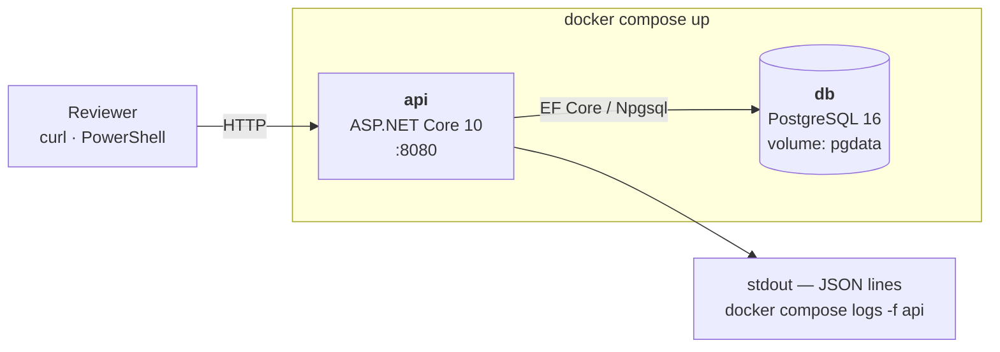
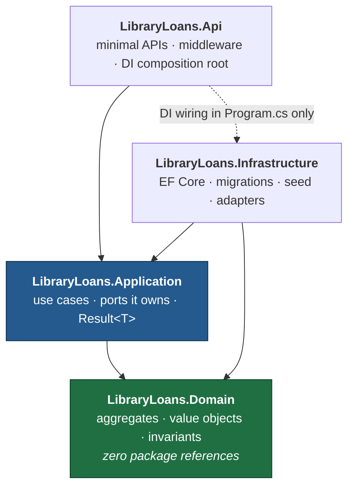
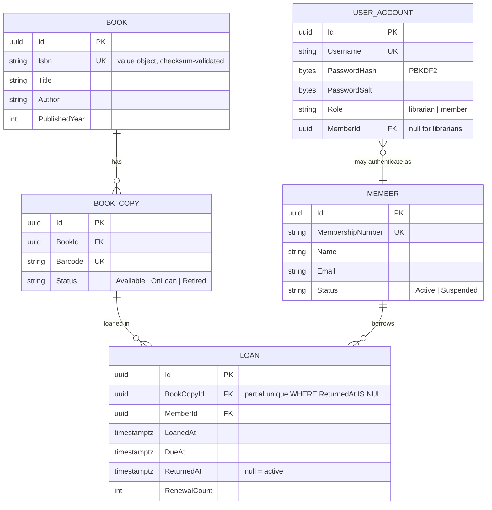
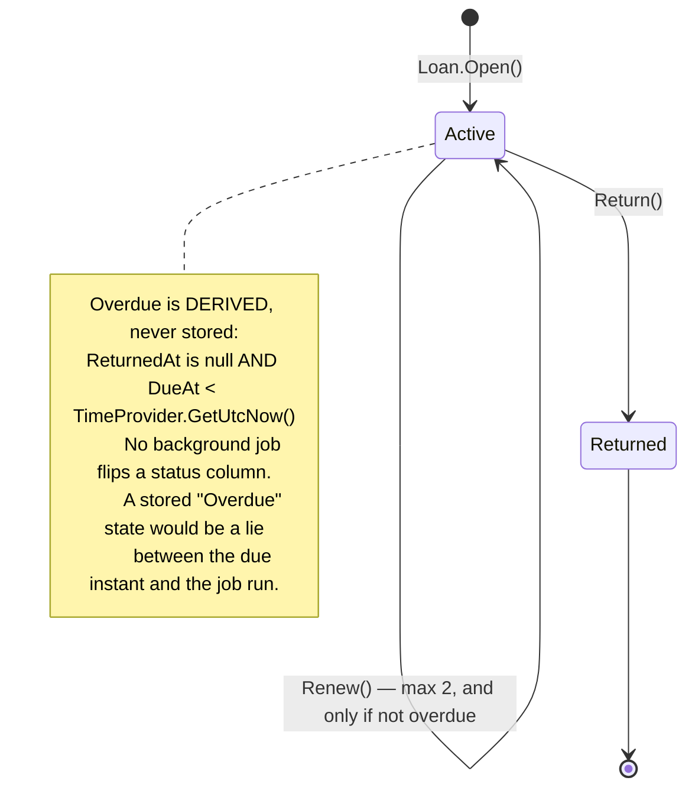
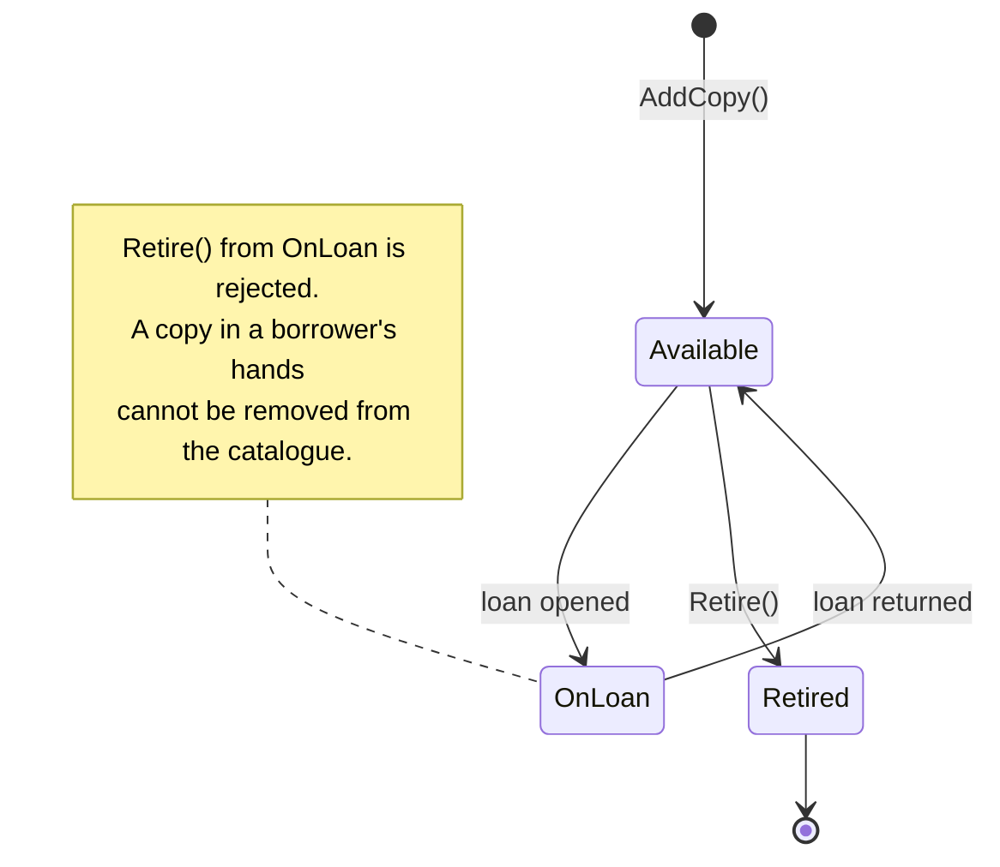
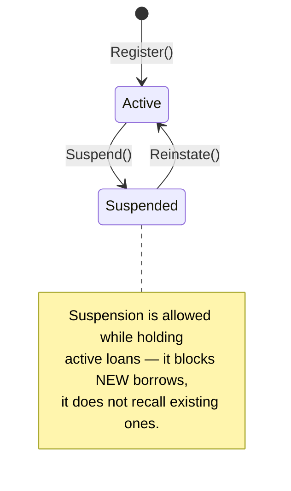
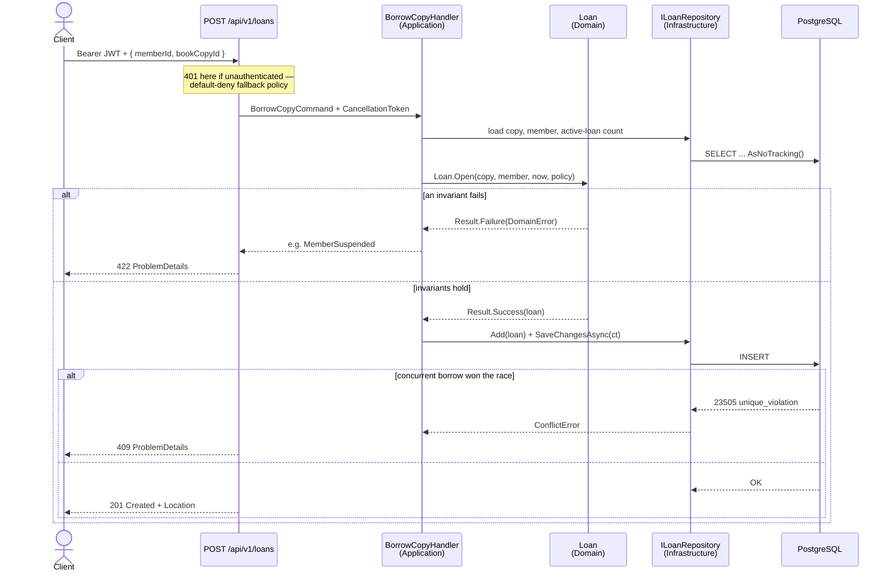

# Architecture — Library Loans API

> ## ⚠ Read this first: this document is part design, part built
>
> It describes the intended architecture of the whole system. **Not all of it exists yet.** The
> repository currently contains a complete vertical slice — the book catalogue — through every
> layer, and the aggregates around loans are designed here but not implemented.
>
> Sections are marked **BUILT** or **DESIGNED, NOT BUILT** so nothing here has to be taken on
> trust. Where a section is unbuilt, the diagram is a specification of intent, not a claim about
> the artifact.
>
> | Section | State |
> |---|---|
> | 1. Deployment view | **BUILT** — `docker compose up` yields a migrated, working API |
> | 2. Layers and the dependency rule | **BUILT** — and enforced by a test |
> | 3. Domain model | **PARTIAL** — `Book` only; `BookCopy`, `Member`, `Loan`, `UserAccount` are design |
> | 4. State machines | **DESIGNED, NOT BUILT** |
> | 5. Request flow — the borrow path | **DESIGNED, NOT BUILT** — the *mechanism* it relies on is built and tested, on a different rule |
> | 6. Cross-cutting concerns | **MIXED** — marked per row |
> | 7. Reading order for a reviewer | **BUILT** — only existing files are listed |
>
> A short, honest statement of current scope is in the README. This file is the deeper "why".

## 1. Deployment view

Everything a reviewer needs is two containers behind one command.

The `api` service waits on the `db` healthcheck, applies migrations, then seeds if the
database is empty. There is no manual database-creation step: compose creates the role and
database from its `POSTGRES_*` environment, the API waits on the healthcheck rather than on a
sleep, and then applies migrations itself.

Migrating on startup is a convenience decision, not a recommendation. In production, migrations
run as a separate deployment step — with several replicas, every instance would otherwise race to
apply the same DDL, and the application's runtime identity would need schema-modification rights
it should never hold. Here it is gated behind `MIGRATE_ON_STARTUP` so the trade is visible and
reversible.

## 2. Layers and the dependency rule

Arrows are compile-time references. **They only point inward.**

The dashed arrow is the only concession: `Api` references `Infrastructure` purely to
register implementations in `Program.cs`. Nothing else in `Api` may use an
`Infrastructure` type.

`Application` **owns** the port interfaces (`IBookRepository`, `ILoanRepository`,
`IUnitOfWork`); `Infrastructure` implements them. That is the dependency inversion that
makes `Application` testable with hand-written fakes and no database.

**Enforced by test, not by convention:**
`DependencyRuleTests.Domain_does_not_reference_infrastructure_or_web_frameworks` walks the
Domain assembly's **transitive** reference graph and fails the build if EF Core or ASP.NET Core
ever appears in it. A companion test,
`Application_does_not_reference_persistence_or_the_web`, does the same for the Application
layer with a deliberately different forbidden list — Application is allowed the two first-party
`Microsoft.Extensions.*.Abstractions` packages, and reusing Domain's stricter list would have
created pressure to loosen the rule that actually matters.

## 3. Domain model

> **PARTIAL.** Only `BOOK` exists in code today, with the `Isbn` value object and its unique
> index. `BOOK_COPY`, `MEMBER`, `LOAN` and `USER_ACCOUNT` below are the intended model.

## 4. State machines

> **DESIGNED, NOT BUILT.** None of the three aggregates below exist in code yet. This section is
> the specification they will be built against.

### Loan

Guards on `Loan.Open()` — all enforced inside the aggregate, none in a service:
- the copy has no active loan (**also** a DB partial unique index)
- the copy is not `Retired`
- the member is `Active`, not `Suspended`
- the member holds fewer than 5 active loans

`Return()` on an already-returned loan is a **domain error**, not a silent no-op.

### BookCopy

### Member

## 5. Request flow — the borrow path

> **DESIGNED, NOT BUILT.** `POST /loans` does not exist yet.
>
> The *mechanism* this flow depends on, however, is built and proven against a real PostgreSQL —
> just applied to a different rule. `CreateBookHandler` checks ISBN uniqueness in advance, the
> unique index decides the outcome when two requests check simultaneously, and
> `UnitOfWork` translates SQLSTATE 23505 back into the identical domain error by matching on
> constraint name. `UniqueConstraintTranslationTests` proves that translation deterministically.
> Porting it to the loan invariant is the next piece of work, and it is a port rather than an
> invention.

This is the sequence worth reading, because it shows the invariant enforced at two levels
and what happens when a race is lost.

**Why both checks.** The aggregate check gives a clean, fast, well-worded rejection for the
common case. The partial unique index is the one that cannot be raced — two requests can
both pass the in-memory check microseconds apart, and exactly one INSERT survives. Catching
`23505` and translating it to a 409 is what makes the rule actually true under concurrency.
Enforcing it only in the aggregate is the mistake most submissions make.

## 6. Cross-cutting concerns

| Concern | Mechanism | State |
|---|---|---|
| Structured logging | `AddJsonConsole` with scopes and UTC timestamps; message templates throughout, never string interpolation, so parameters stay queryable fields | **BUILT** |
| Error shaping | `IExceptionHandler` + `AddProblemDetails()` → RFC 7807, with `DomainError.Code` surfaced as the `code` extension. Exception messages never reach a client. | **BUILT** |
| Client disconnects | an aborted request is logged at Information and answered with no body, so error-rate alerting does not track how often users close tabs | **BUILT** |
| Validation | value objects reject invalid state at construction; `Result<T>` carries failures outward; DataAnnotations on request DTOs for shape only | **BUILT** |
| Time | `TimeProvider` injected everywhere — no `DateTime.UtcNow` anywhere in the solution, including tests | **BUILT** |
| Resilience | `EnableRetryOnFailure` on the Npgsql connection | **BUILT** |
| Health | `/health/live` — process liveness, touching no dependency | **BUILT** |
| Health | `/health/ready` — readiness with a database probe | not built |
| Request logging | one enriched line per request: method, path, status, elapsed | not built |
| Correlation | middleware generating and echoing `X-Correlation-Id`, pushed as a log scope so every line in a request carries it | not built |
| AuthN/AuthZ | JWT bearer with `FallbackPolicy = RequireAuthenticatedUser` — default-deny, so a forgotten attribute causes a 401 rather than a silent hole | not built |
| Rate limiting | fixed window on write endpoints | not built |

The logging rows deserve one clarification, since a reader may expect a named library: logging
goes through `ILogger` and writes JSON to stdout via the built-in console formatter. That is
deliberately a swap and not a rewrite — replacing the sink changes composition-root wiring and
nothing else, which is exactly why no logging library is load-bearing here.

`TimeProvider` deserves the callout: it makes "is this loan overdue" a deterministic unit
test instead of a `Thread.Sleep`, and it is first-party since .NET 8.

### What never gets logged

Logs are structured, which means every parameter in a message template becomes a queryable
field that outlives the request and gets shipped wherever logs go. So the rule is stated before
there is anything to break it: **personal data does not go into a log line.** Identifiers do —
`MemberId`, `LoanId`, `BookId` — because they are meaningless outside the database and are
exactly what an investigation needs. Names, email addresses and membership numbers do not.

Written down before there is a `Member` type to break it, because the alternative is discovering
an email address in a log field during a review and retrofitting the rule across every handler.

## 7. Reading order for a reviewer

Four files that exist today, in this order, tell most of the story:

1. **`src/LibraryLoans.Domain/Books/Isbn.cs`** — why the value object canonicalises ISBN-10 into
   ISBN-13 rather than merely validating it. Both encodings satisfy their own check digit, so a
   validating-only type would let the catalogue hold one book twice under a unique index that
   claims otherwise.
2. **`src/LibraryLoans.Infrastructure/Persistence/UnitOfWork.cs`** — the half of a uniqueness
   rule most implementations leave out: translating the database's ruling back into the same
   domain error the in-memory check produces, matched on constraint name so an unrelated
   collision is never misreported.
3. **`src/LibraryLoans.Infrastructure/Persistence/Migrations/`** — the unique index that makes
   the rule true under concurrency, rather than merely usually true.
4. **`tests/LibraryLoans.UnitTests/Architecture/DependencyRuleTests.cs`** — the dependency rule
   as an executable check over the transitive reference graph, not a diagram.

Then, if the reasoning about concurrency is of interest:
`tests/LibraryLoans.IntegrationTests/Books/UniqueConstraintTranslationTests.cs`, whose comment
explains why the parallel-request test *cannot* prove the translation path and what to test
instead.

When the loan aggregate is built, `Domain/Loans/Loan.cs` and the partial unique index on
`(book_copy_id) WHERE returned_at IS NULL` become the first two files worth reading, because a
temporal invariant expressed as a static index is the more interesting version of the same idea.
