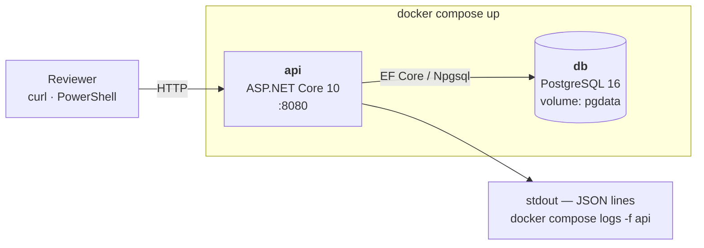
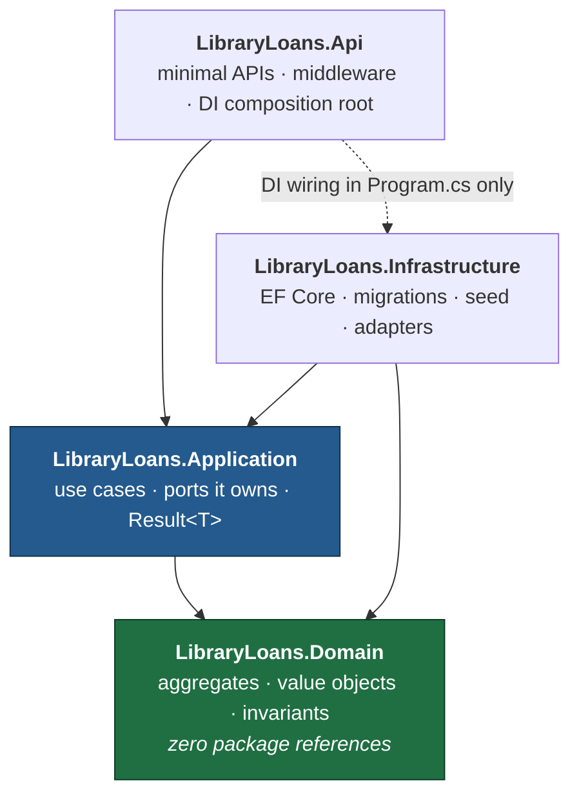
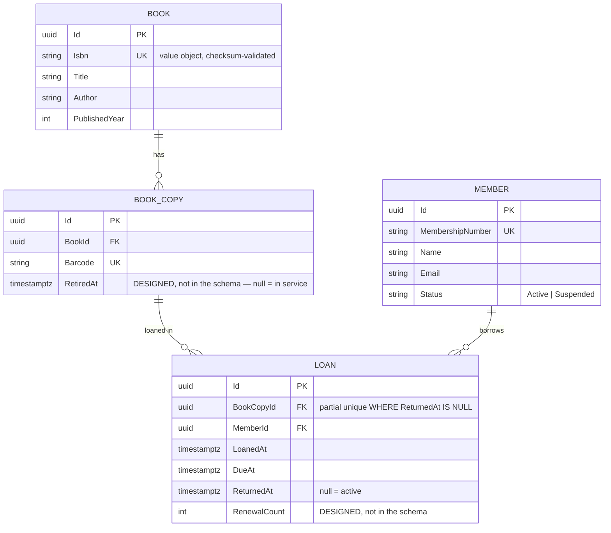
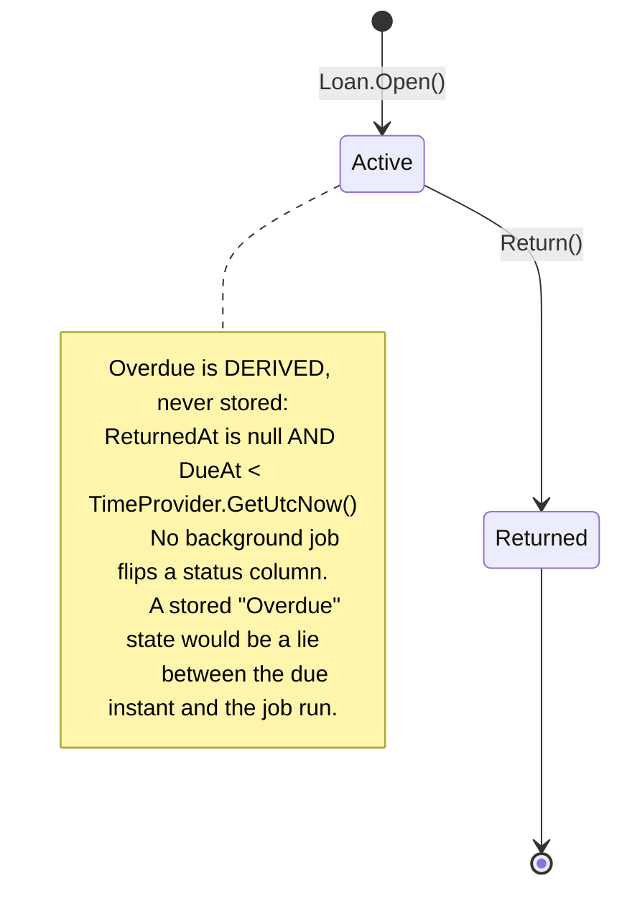
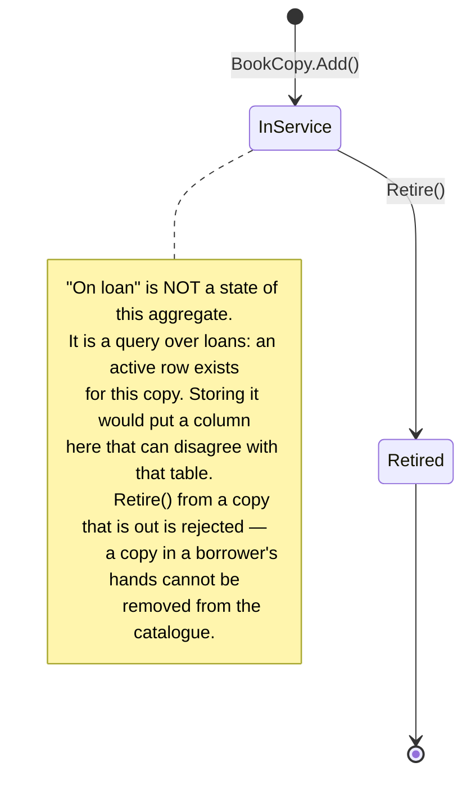
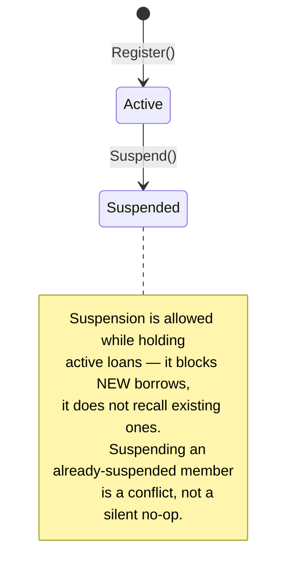
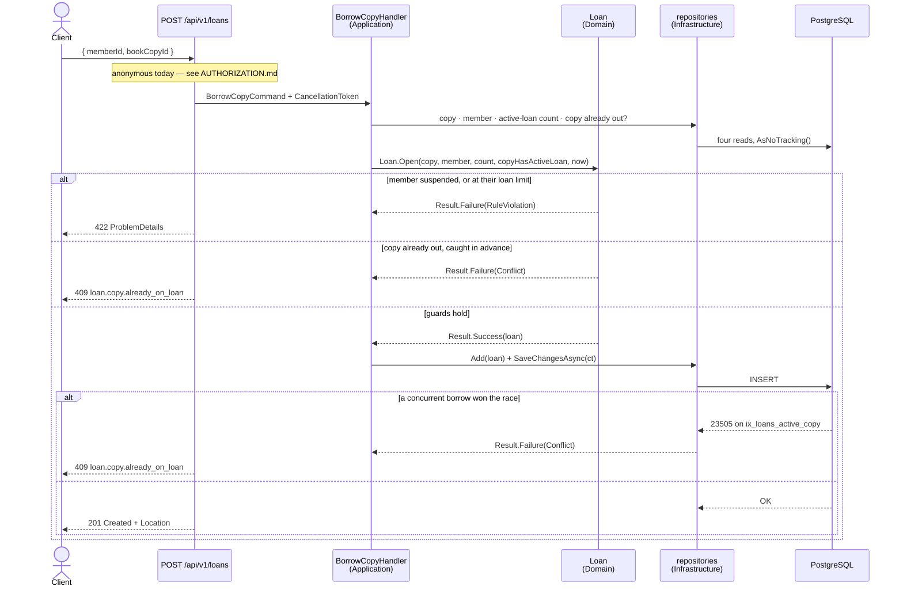

# Architecture — Library Loans API

> ## ⚠ Read this first: this document is part design, part built
>
> It describes the intended architecture of the whole system. **Not all of it exists yet.**
>
> What does: the catalogue and the lending cycle. Books, physical copies, members and loans are
> implemented through every layer, and with them every domain rule this system claims — including
> the one that shapes the design, that a copy cannot be on two active loans at once.
>
> What does not: the parts of the copy and member lifecycles that no current rule needs (retiring a
> copy, renewing a loan, reinstating a suspended member), the read and write breadth beyond what is
> listed in the README, seed data, and authentication.
>
> Sections are marked **BUILT**, **PARTIAL** or **DESIGNED, NOT BUILT** so nothing here has to be
> taken on trust. Where something is unbuilt, the diagram is a specification of intent, not a claim
> about the artifact, and it says so where it appears.
>
> | Section | State |
> |---|---|
> | 1. Deployment view | **BUILT** — `docker compose up` yields a migrated, working API |
> | 2. Layers and the dependency rule | **BUILT** — and enforced by a test |
> | 3. Domain model | **BUILT**, except two columns marked inline as designed-not-in-schema |
> | 4. State machines | **PARTIAL** — Loan and Member built; BookCopy has no lifecycle state yet |
> | 5. Request flow — the borrow path | **BUILT** |
> | 6. Cross-cutting concerns | **MIXED** — marked per row |
> | 7. Reading order for a reviewer | **BUILT** — only existing files are listed |
>
> A short, honest statement of current scope is in the README. This file is the deeper "why".

## 1. Deployment view

Everything a reviewer needs is two containers behind one command.

There is no manual database-creation step: compose creates the role and database from its
`POSTGRES_*` environment, the API waits on the `db` healthcheck rather than on a sleep, and then
applies migrations itself.

**The database comes up empty.** There is no seeder yet, so a reviewer following the README's quick
start creates the first rows themselves. Seeding is planned and will be gated behind a
`SEED_ON_STARTUP` flag, which is deliberately absent from `compose.yaml` until something reads it.

Migrating on startup is a convenience decision, not a recommendation. In production, migrations
run as a separate deployment step — with several replicas, every instance would otherwise race to
apply the same DDL, and the application's runtime identity would need schema-modification rights
it should never hold. Here it is gated behind `MIGRATE_ON_STARTUP` so the trade is visible and
reversible.

## 2. Layers and the dependency rule

Arrows are compile-time references. **They only point inward.**

The dashed arrow is the only concession: `Api` references `Infrastructure` purely to
register implementations in `Program.cs`. Nothing else in `Api` may use an
`Infrastructure` type.

`Application` **owns** the port interfaces (`IBookRepository`, `ILoanRepository`,
`IUnitOfWork`); `Infrastructure` implements them. That is the dependency inversion that
makes `Application` testable with hand-written fakes and no database.

**Enforced by test, not by convention:**
`DependencyRuleTests.Domain_does_not_reference_infrastructure_or_web_frameworks` walks the
Domain assembly's **transitive** reference graph and fails the build if EF Core or ASP.NET Core
ever appears in it. A companion test,
`Application_does_not_reference_persistence_or_the_web`, does the same for the Application
layer with a deliberately different forbidden list — Application is allowed the two first-party
`Microsoft.Extensions.*.Abstractions` packages, and reusing Domain's stricter list would have
created pressure to loosen the rule that actually matters.

## 3. Domain model

> **BUILT**, with two exceptions marked inline: `BOOK_COPY.RetiredAt` and `LOAN.RenewalCount` are
> designed but not in the schema — they arrive with copy retirement and renewals.
>
> **There is no availability or status column on `BOOK_COPY`, and that is the deliberate part.**
> "On loan" is derived state: it is true exactly when a loan row exists for the copy with a null
> `ReturnedAt`. Storing it would mean writing two tables on every borrow, and would create a column
> that can disagree with the loans table — which is precisely the corruption the partial unique
> index exists to prevent, and which that index could not police, since it constrains `LOAN` only.
>
> The alternative was weighed rather than overlooked. A materialised availability flag turns
> "which copies are free" from an anti-join into an index seek, which is a real design at real
> scale, and the only ways to keep such a flag honest are a trigger, a materialised view, or
> discipline. It costs nothing to decline here, because
> `NOT EXISTS (SELECT 1 FROM loans WHERE book_copy_id = c.id AND returned_at IS NULL)` is served by
> `ix_loans_active_copy` itself — **the index that makes the invariant true is the same index that
> makes the availability query fast.**
>
> There is deliberately **no user or credential table**. Authentication would come from an
> external OIDC provider, so identities live there and this service stores no passwords — see
> [AUTHORIZATION.md](AUTHORIZATION.md). A `Member` is a library borrower, not a login.

## 4. State machines

> **PARTIAL**, per aggregate:
> **Loan — BUILT.** **Member — BUILT.** **BookCopy — DESIGNED, NOT BUILT**, because the copy has no
> lifecycle state yet; it is `{ Id, BookId, Barcode }` in code.
>
> Transitions shown below that have no method behind them are labelled where they appear.

### Loan

Guards on `Loan.Open()` — all enforced inside the aggregate, none in a service, and in this order:

1. the member is `Active`, not `Suspended`
2. the member holds fewer than 5 active loans
3. the copy has no active loan (**also** a database partial unique index)

The order is deliberate. A caller's own eligibility is reported before the resource's, so a
suspended member is told they are suspended rather than sent to look for a different copy. And the
copy check is last precisely because it is the one the database also enforces — which keeps the
"same error whichever layer noticed" property about a single, final guard.

Only guard 3 is enforced twice, and the asymmetry is the argument: guard 2 can also be raced, and a
member briefly holding six books is a policy annoyance a librarian can unwind, while the same
physical book promised to two people is a failure the library cannot honour.

`Return()` on an already-returned loan is a **domain error**, not a silent no-op. Two concurrent
returns can both pass that guard — accepted, because the outcome is idempotent in substance and
nothing is promised twice. The race that *is* arbitrated is more interesting: a return running
concurrently with a re-borrow of the same copy, where the new row cannot land while the old one
still has a null `ReturnedAt`.

*Renewal is designed but not built: `Renew()`, capped at two and refused once overdue, arrives with
`LOAN.RenewalCount`.*

### BookCopy — DESIGNED, NOT BUILT

Only the `Add` transition exists in code. `BookCopy` is currently `{ Id, BookId, Barcode }` with no
lifecycle state at all, and `Retire()` arrives with the copy-management endpoints. The rule
governing it — a copy on loan cannot be retired — is deferred with it, on the principle that a
guard whose precondition cannot be reached is a guard that cannot be tested.

### Member

*Reinstatement is designed but not built: `Reinstate()` arrives with the member-management
endpoints. Nothing in the current rule set needs the `Suspended → Active` transition, and adding a
method with no caller and no invariant behind it would be a lever nobody pulls.*

## 5. Request flow — the borrow path

> **BUILT.**

This is the sequence worth reading, because it shows the invariant enforced at two levels and what
happens when a race is lost.

Note the two 409 branches carry the **identical** error code. That is the point: one was decided in
memory and one by the database, and a client cannot tell which. Both come from the same factory
method, so they cannot drift apart.

**Why both checks.** The aggregate check gives a clean, fast, well-worded rejection for the common
case. The partial unique index is the one that cannot be raced — two requests can both pass the
in-memory check microseconds apart, and exactly one INSERT survives. Catching `23505`, matching on
the constraint *name* so an unrelated collision is never misreported, and translating it back into
the same domain error is what makes the rule actually true under concurrency. Enforcing it only in
the aggregate is the mistake most submissions make.

**Four reads before one write.** Named rather than hidden: the alternative is a single query
returning all four facts, which would mean `Loan.Open` taking loose scalars instead of the
aggregates whose rules it applies — moving the rules out of the objects that own them to save three
round trips. At a library's request rate that trade is clear; at a different rate it would not be.

## 6. Cross-cutting concerns

| Concern | Mechanism | State |
|---|---|---|
| Structured logging | `AddJsonConsole` with scopes and UTC timestamps; message templates throughout, never string interpolation, so parameters stay queryable fields | **BUILT** |
| Error shaping | `IExceptionHandler` + `AddProblemDetails()` → RFC 7807, with `DomainError.Code` surfaced as the `code` extension. Exception messages never reach a client. | **BUILT** |
| Client disconnects | an aborted request is logged at Information and answered with no body, so error-rate alerting does not track how often users close tabs | **BUILT** |
| Validation | value objects reject invalid state at construction; `Result<T>` carries failures outward; DataAnnotations on request DTOs for shape only | **BUILT** |
| Time | `TimeProvider` injected everywhere — no `DateTime.UtcNow` anywhere in the solution, including tests | **BUILT** |
| Resilience | `EnableRetryOnFailure` on the Npgsql connection | **BUILT** |
| Health | `/health/live` — process liveness, touching no dependency | **BUILT** |
| Health | `/health/ready` — readiness with a database probe | not built |
| Request logging | one enriched line per request: method, path, status, elapsed | not built |
| Correlation | middleware generating and echoing `X-Correlation-Id`, pushed as a log scope so every line in a request carries it | not built |
| AuthN/AuthZ | JWT bearer against an external OIDC provider, `FallbackPolicy = RequireAuthenticatedUser` — default-deny, so a forgotten attribute causes a 401 rather than a silent hole. Design and seams in [AUTHORIZATION.md](AUTHORIZATION.md) | **not built, by decision** |
| Rate limiting | fixed window on write endpoints | not built |

The logging rows deserve one clarification, since a reader may expect a named library: logging
goes through `ILogger` and writes JSON to stdout via the built-in console formatter. That is
deliberately a swap and not a rewrite — replacing the sink changes composition-root wiring and
nothing else, which is exactly why no logging library is load-bearing here.

`TimeProvider` deserves the callout: it makes "is this loan overdue" a deterministic unit
test instead of a `Thread.Sleep`, and it is first-party since .NET 8.

### What never gets logged

Logs are structured, which means every parameter in a message template becomes a queryable
field that outlives the request and gets shipped wherever logs go. So the rule is stated before
there is anything to break it: **personal data does not go into a log line.** Identifiers do —
`MemberId`, `LoanId`, `BookId` — because they are meaningless outside the database and are
exactly what an investigation needs. Names, email addresses and membership numbers do not.

Written down before there is a `Member` type to break it, because the alternative is discovering
an email address in a log field during a review and retrofitting the rule across every handler.

## 7. Reading order for a reviewer

Six files that exist today, in this order, tell most of the story:

1. **`src/LibraryLoans.Domain/Loans/Loan.cs`** — every rule about whether a copy may leave the
   building, in one file, with the reasoning for the guard order and for which races are accepted
   and which are not.
2. **`src/LibraryLoans.Infrastructure/Persistence/Configurations/LoanConfiguration.cs`** — the
   partial unique index on `(book_copy_id) WHERE returned_at IS NULL`. The filter is not an
   optimisation; it is the difference between "a copy may have one active loan" and "a copy may be
   borrowed once, ever". A temporal invariant expressed as a static index.
3. **`src/LibraryLoans.Infrastructure/Persistence/UnitOfWork.cs`** — the half of a uniqueness rule
   most implementations leave out: translating the database's ruling back into the same domain
   error the in-memory check produces, matched on constraint name so an unrelated collision is
   never misreported.
4. **`tests/LibraryLoans.IntegrationTests/Loans/LoansEndpointsTests.cs`** — two tests carry the
   argument. `Allows_exactly_one_of_two_simultaneous_borrows_of_one_copy` proves the rule survives a
   race, asserting the row count and not merely the status codes. `Borrows_the_same_copy_again_after_it_has_been_returned`
   is the one that would fail if the index were plain rather than partial — every other test in the
   suite passes either way, which is why it was written before the migration was scaffolded.
5. **`src/LibraryLoans.Domain/Books/Isbn.cs`** — why the value object canonicalises ISBN-10 into
   ISBN-13 rather than merely validating it. Both encodings satisfy their own check digit, so a
   validating-only type would let the catalogue hold one book twice under a unique index that
   claims otherwise.
6. **`tests/LibraryLoans.UnitTests/Architecture/DependencyRuleTests.cs`** — the dependency rule as
   an executable check over the transitive reference graph, not a diagram.

Then, if the reasoning about concurrency is of interest:
`tests/LibraryLoans.IntegrationTests/Loans/LoanConstraintTranslationTests.cs` and its counterpart
for books, whose comments explain why the parallel-request test *cannot* prove the translation path
and what to test instead.
