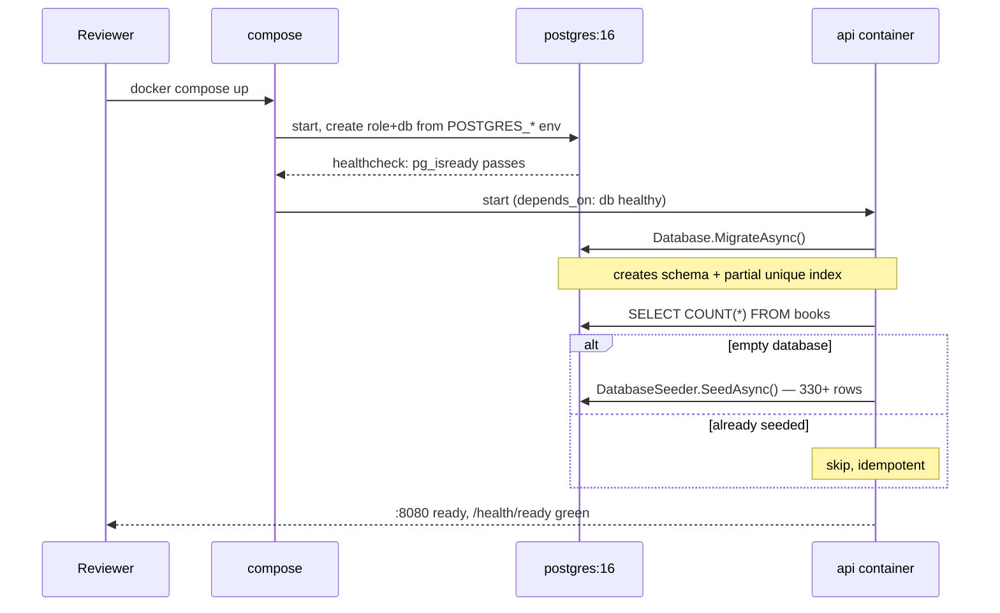
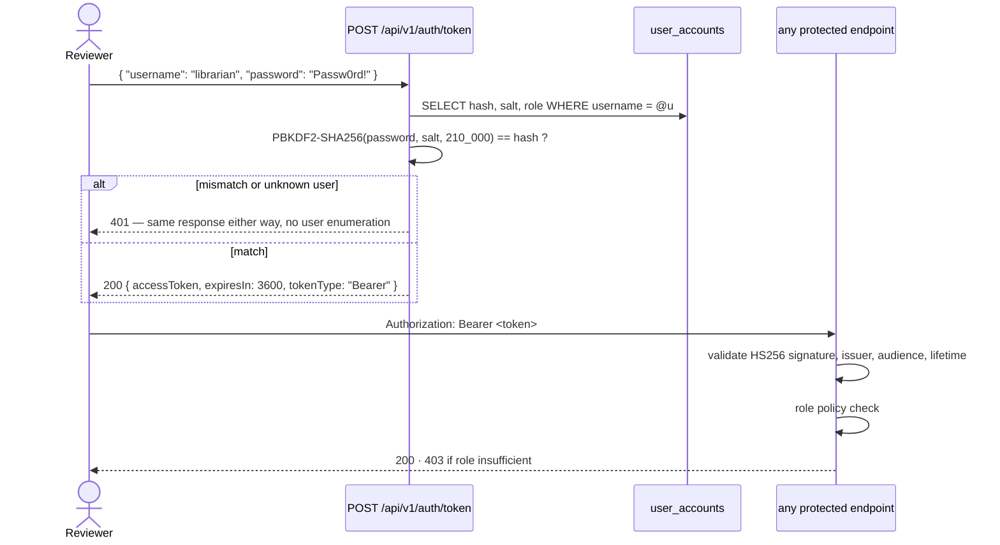

# Database bootstrap and authentication

> **Status: design, not yet built.** Part 1 (migrate on startup) is implemented as of P1.
> Everything about authentication — `POST /api/v1/auth/token`, the seeded accounts, the JWT
> policies, `/health/ready` — is scheduled for **P4**, and the seeding described in Part 1 for
> **P5**. Nothing in those sections responds today. This file is written in the present tense
> because it is a specification; treat it as what the system will do, not what it does.

The design goal for both: **a reviewer with only Docker installed goes from `git clone` to
an authenticated API call in under five minutes, with no cloud account, no manual SQL, and
no config editing.** Anything that fails that test gets redesigned.

## Part 1 — how the database gets created

Nobody creates it by hand. The chain is:



Three deliberate choices to defend in the README:

1. **`depends_on: { db: { condition: service_healthy } }`** — not a `sleep`. The API never
   races the database on a cold start.
2. **Migrate on startup, gated.** Controlled by `MIGRATE_ON_STARTUP`, `true` in compose.
   (`SEED_ON_STARTUP` will join it in P5, when there is a seeder to read it; it is deliberately
   absent from `compose.yaml` until then, because a flag nothing reads reads as configuration
   that works.) The README states plainly that in production you run migrations
   as a separate deployment step, because startup-migration on N replicas is a race and
   gives the app's runtime identity DDL rights. Doing it here is a *reviewer-experience*
   decision, and saying so out loud is the senior move.
3. **Seeding is idempotent** — it checks for emptiness first, so `docker compose restart`
   never duplicates data. The seed uses a fixed `Random` seed, so the data is byte-identical
   on every machine and integration tests can assert against known rows.

Reset to a clean slate:

```bash
docker compose down -v    # -v drops the pgdata volume
docker compose up
```

## Part 2 — how you log in

No Azure AD, no external identity provider, no OAuth dance. The API issues its own JWTs
against a seeded `user_accounts` table.



### Seeded accounts

| Username | Password | Role | Can do |
|---|---|---|---|
| `librarian` | `Passw0rd!` | `librarian` | everything: CRUD on books, copies, members; borrow/return on behalf of any member |
| `member` | `Passw0rd!` | `member` | read the catalogue; borrow/return **as themselves only** |
| `suspended` | `Passw0rd!` | `member` | authenticates fine, but every borrow returns 422 — lets a reviewer exercise the suspension rule without editing data |

That third account exists purely so the reviewer can *see* a domain rule fire. Small touch,
disproportionate payoff.

### Password storage

PBKDF2-SHA256, 210,000 iterations, 128-bit per-user salt, via
`Rfc2898DeriveBytes` from the BCL — no package, and PBKDF2 is a standard KDF, so this is
not "rolling your own crypto." Comparison is constant-time via
`CryptographicOperations.FixedTimeEquals`. The README notes that a production system would
use ASP.NET Core Identity or an external IdP; this exists so the submission is
self-contained.

### Authorization model

`FallbackPolicy = RequireAuthenticatedUser` — **every endpoint requires a token unless it
explicitly opts out.** Only `/health/*` and `/api/v1/auth/token` carry `[AllowAnonymous]`.

This is the direct correction of the fail-open middleware in the author's previous system,
and it is worth one sentence in the README: default-deny means a forgotten attribute causes
a 401, not a silent hole.

| Policy | Applied to |
|---|---|
| `RequireLibrarian` | writes on books, copies, members; return-on-behalf |
| `RequireMember` | borrow/return where the token's `memberId` claim must match the request |
| anonymous | `/health/live`, `/health/ready`, `/api/v1/auth/token` |

### Where the signing key lives

`compose.yaml` sets `Jwt__SigningKey` to an obviously-development value, and the README
labels it as such in bold. It is not a secret and is not pretending to be one. Production
guidance goes in the README's "what I'd do differently" section: Key Vault or a container
secret, asymmetric RS256 so verification does not require the signing key, and short-lived
tokens with refresh.

## Part 3 — the reviewer's five minutes

```bash
git clone <repo> && cd library-loans
docker compose up -d                     # ~40s on a cold pull

curl -s localhost:8080/health/ready      # {"status":"Healthy"}

TOKEN=$(curl -s localhost:8080/api/v1/auth/token \
  -H 'Content-Type: application/json' \
  -d '{"username":"librarian","password":"Passw0rd!"}' | jq -r .accessToken)

curl -s "localhost:8080/api/v1/books?search=tolkien&page=1&pageSize=5" \
  -H "Authorization: Bearer $TOKEN"

curl -s -X POST localhost:8080/api/v1/loans \
  -H "Authorization: Bearer $TOKEN" -H 'Content-Type: application/json' \
  -d '{"memberId":"<id>","bookCopyId":"<id>"}'
```

PowerShell equivalents go in the README too — "works on Mac **or** Windows" is an explicit
requirement, and shipping only bash commands quietly fails half of it.

`requests.http` at the repo root does all of the above with clickable requests and captures
the token into a variable automatically, so the reviewer never copy-pastes a JWT.

## Part 4 — running the tests without touching this database

The brief is explicit that tests must not rely on the dev database. Integration tests use
**Testcontainers**:

1. a disposable `postgres:16-alpine` container is started for the test run,
2. `MigrateAsync()` builds the schema in it,
3. tests run against it through `WebApplicationFactory`, which is pointed at the
   container's connection string,
4. the container is destroyed in `DisposeAsync`.

So `dotnet test` is the entire loop — no `compose up` first, no shared state, no cleanup to
forget. The development database is never read or written, and a reviewer cannot
accidentally run the suite against it because the connection string is generated at runtime.

Unit tests need nothing running at all. That separation is stated in the README so a
reviewer without Docker still has a suite they can execute.
